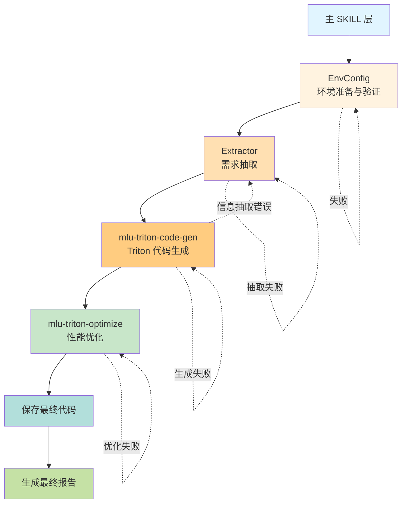

# MLU Triton MAIN

## 概述

本 skill 采用**分层设计**完成任务。执行流程为：初始化/恢复运行清单 → 环境准备与验证 → 需求分析与验证 → Triton 代码生成 → 按需性能优化 → 输出最终报告和代码。每个外层阶段都由内容指纹、产物哈希和共享缓存保护。



## 核心原则

### Subagent 启动规则
部分任务需要通过分发给 subagent 执行，涉及 subagent 必须遵循以下规则：

- subagent 负责的任务由主流程分发
- subagent 任务一旦分发，主流程不得代替它改写其业务产物，但必须校验产物、记录失败并按阶段契约重试或终止
- subagent 为阻塞式执行，完成后主流程才能进入下一步
- 禁止并发启动多个 subagent

### 输出路径规则

如果用户没有特别指定输出存储路径`output_dir`，则 `output_dir` 默认为当前路径下的`output_mlu_triton_main`目录

### 缓存与断点续跑

详细命令、阶段 DAG、失效传播和安全边界见 [references/run-control.md](references/run-control.md)。主流程是 `{output_dir}/run_manifest.json` 的唯一写入者，各下游 Skill 不得自行伪造外层阶段完成状态。

开始业务步骤前：

- 清单不存在时运行 `run_control.py init`，输入必须是用户输入文件路径或原始需求文本，并传入最终确定的 `optimization_mode`、显式预算文件和可选共享缓存目录。
- 清单已存在时禁止再次 `init`，必须运行 `run_control.py resume`。恢复不会删除阶段目录，也不会重置 Optimizer 的全局预算。
- 每个步骤前运行 `next`；返回 `restore` 时先恢复缓存并跳过对应 Skill，返回 `run` 时先 `start` 再执行，成功后 `complete`，失败时 `fail`。
- 任何 `complete` / `cached` 记录只有在当前 Skill 源指纹、产物 SHA-256 和阶段要求的验证等级都有效时才能复用；失效从本阶段向全部下游传播。
- `extractor` 缓存要求 L1+L2；`kernel_gen` 与 `optimizer` 缓存要求 L1+L2+L3。未提供足够验证等级时可以完成本次阶段，但不得发布共享缓存。

初始化示例：

```bash
python .claude/skills/mlu-triton-main/scripts/run_control.py init \
  --output-dir <output_dir> --input <用户输入文件或需求文本> \
  --mode <optimization_mode> [--budget-file <budget.json>] [--cache-dir <cache_dir>]
```

后续命令统一使用 `run_manifest={output_dir}/run_manifest.json`。同一清单禁止并发写入。

### 优化模式

主流程接受 `optimization_mode`：

- 用户明确要求“只保证正确、不要优化、快速生成”时使用 `correctness`。
- 用户明确要求“极致性能、深度优化、最大性能”时使用 `max-performance`。
- 其他情况默认 `balanced`。

用户可额外提供 `optimization_budget_file` JSON 路径。不得从自然语言自行发明预算数值；未提供时使用 `mlu-triton-optimize` 的模式默认值。

### 运行环境选择

Triton 算子开发既可能运行在带 MLU 的本地执行环境里，也可能运行在只有 CPU 的本地执行环境里。进入 Triton 代码真实运行、精度测试、性能测试等动态步骤前，必须先判断当前本地执行环境是否具备可用 MLU。

**强制顺序**：所有任务开始前，必须先完成 EnvConfig 环境确认。EnvConfig 必须先在本地执行环境顺序执行以下两个脚本：

```bash
python .claude/skills/share/mlu/runtime/get_device_info.py
python .claude/skills/share/mlu/runtime/test_env_code.py
```

判定规则：

- 如果 `get_device_info.py` 和 `test_env_code.py` 都在本地执行环境 exit code = 0，则判定 `execution_backend=local`，后续 Triton 真实运行、精度测试、性能测试优先直接在本地执行。
- 如果任意一个脚本在本地执行环境失败，则判定本地 MLU/Triton 环境不可用，必须在当前 `JOB_ID` 下通过 `.claude/skills/mlu-triton-main/subagents/scripts/submit_task_to_worker.py` 向远端 Worker 提交同一套环境检查脚本，先确认远端 MLU 环境可用。
- 远端 Worker 环境检查也必须顺序执行 `get_device_info.py` 和 `test_env_code.py`，两者都成功后才允许进入后续动态步骤，并记录 `execution_backend=worker`。
- 如果本地执行环境和 Worker 环境检查都失败，必须停止工作流并报告真实 stdout/stderr，禁止继续生成依赖运行结果的结论。
- 纯文本分析、代码生成、静态检查、Python 语法检查可以在本地执行环境执行；涉及 MLU 真实运行、精度或性能结论时，必须以实际可用的 MLU 环境结果为准。
- 无论选择本地执行还是 Worker Task，都禁止为了编译、测试、精度或性能验证再新建一个 Job。
- **Worker Task 阻塞执行**：每次调用 `submit_task_to_worker.py` 必须前台同步运行，等待该进程退出（脚本内部已轮询到终态才返回，退出码 `0` 成功 / `1` 失败 / `2` 基础设施错误），拿到退出码与日志后再决定下一步。禁止 `&` 后台、禁止并发提交多个 Worker Task、禁止在脚本未返回前发起其它步骤。

Worker Task 仅作为当前本地执行环境没有可用 MLU/工具链时的执行兜底。远端环境检查命令必须使用：```bash
python .claude/skills/mlu-triton-main/subagents/scripts/submit_task_to_worker.py \
    --task-type custom \
    --workdir <仓库根目录的绝对路径> \
    --timeout-sec 600 \
    --command "python .claude/skills/share/mlu/runtime/get_device_info.py && python .claude/skills/share/mlu/runtime/test_env_code.py"
```

后续动态执行如需走 Worker，使用方式：

```bash
python .claude/skills/mlu-triton-main/subagents/scripts/submit_task_to_worker.py \
    --task-type {accuracy|performance|custom} \
    --workdir <绝对路径> \
    --timeout-sec <运行阶段超时秒数> \
    --command "<要执行的命令>"
```

Worker Task 必须等到 `submit_task_to_worker.py` 返回退出码后再继续；结果判断以该退出码和其打印的 `task_output_dir` 下 `stdout.log`、`stderr.log`、`result.json` 为准；Agent 必须通过 `--timeout-sec` 设置 Worker lease 后才开始计时的运行阶段超时，Scheduler 会额外用当前 Job 剩余时间限制排队 + 运行的总截止时间。禁止手写 HTTP 请求绕过 `submit_task_to_worker.py`，禁止通过 Worker Task 安装、升级、卸载依赖，或修改 Worker 全局环境、系统路径、NeuWare/MLU 工具链等共享环境。

## 步骤

### 步骤 1：环境准备与验证

先确认 `next` 返回 `env_config/run`，再执行 `start --stage env_config`。EnvConfig 成功且三个必需产物存在后执行：

```bash
python .claude/skills/mlu-triton-main/scripts/run_control.py complete \
  --manifest <run_manifest> --stage env_config
python .claude/skills/mlu-triton-main/scripts/run_control.py bind-context \
  --manifest <run_manifest> --context-file <output_dir>/EnvConfig/run_context.json
```

`env_config` 永不从缓存恢复；每次运行都重新确认设备可用性。若执行失败，先记录 `fail --stage env_config --reason <真实原因>` 再停止。

**重点要求**：分发给 subagent 执行`环境准备与验证`任务（禁止主流程接管此任务）:

使用以下方式调用该操作
```python
agent = spawn_agent(
    agent_type="default",
    message=f"""
    ## 任务文档
    根据 .claude/skills/mlu-triton-main/subagents/EnvConfig.md 中的规范要求，充当 EnvConfig 角色，逐步完成环境准备与验证任务。

    ## 用户输入
    输出存储路径：{output_dir}

    严格按照任务文档要求执行。
    """
)
```

### 步骤 2：需求抽取

先执行 `next`：若返回 `extractor/restore`，执行 `restore --stage extractor` 并跳过 Subagent；若返回 `extractor/run`，执行 `start --stage extractor` 后再分发任务。成功并完成结构/行为检查后执行 `complete --stage extractor --validation-level l1 --validation-level l2`，失败则记录 `fail`。

**重点要求**：分发给 subagent 执行`需求抽取`任务（禁止主流程接管此任务）:

使用以下方式调用该操作
```python
agent = spawn_agent(
    agent_type="default",
    message=f"""
    ## 任务文档
    根据 .claude/skills/mlu-triton-main/subagents/Extractor.md 中的规范要求，充当 Extractor 角色，完成需求抽取任务。

    ## 用户输入
    算子功能需求描述或 Triton 代码：{user_input}
    输出存储路径：{output_dir}

    严格按照任务文档要求执行。
    """
)
```

### 步骤 3：Triton 代码生成

**输入文件**（来自步骤 2，由 `Extractor` 负责存储）：
- 需求文档：`{output_dir}/Extractor/requirement.md`

**交接文件**（由 `mlu-triton-code-gen` Skill 负责存储，供步骤 4 读取）：
- Triton Kernel 最终代码：`{output_dir}/KernelGen/triton_code_fix.py`（包含 kernel + wrapper + 测试代码，经 code-review 修复后的版本）
- 代码生成报告：`{output_dir}/KernelGen/triton_report.md`
- L3 代码验证结果：`{output_dir}/KernelGen/review_result.json`
- 调度度量：`{output_dir}/KernelGen/dispatch_metrics.json`

> 说明：主 Skill **不再重复存储**以上文件，交接文件的生成与落盘统一由 `mlu-triton-code-gen` Skill 完成；本步骤只负责**按指定路径校验文件是否存在**，并在步骤 4 中按该路径读取。

使用 `mlu-triton-code-gen` Skill 中的操作指引进行 Triton 代码生成。必须直接调用/加载该 Skill，不得通过 subagent 间接调用。传入参数：
- `requirement` = `{output_dir}/Extractor/requirement.md`
- `output_dir` = `{output_dir}`

**交接验证（必须执行）**：步骤 3 结束后，必须确认 `{output_dir}/KernelGen/triton_code_fix.py` 文件存在且可读；若缺失，视为步骤 3 失败，按回退机制重跑，**禁止跳到步骤 4**。

**阶段控制（必须执行）**：调用 Skill 前服从 `next` 对 `kernel_gen` 的判定。`restore` 命中时由控制器恢复并校验 `triton_code_fix.py`、`triton_report.md`、`review_result.json` 和 `dispatch_metrics.json`，不得再次调用 Code Gen；`run` 时先 `start`。Code Gen 内部按 `design/build/review` 保存分组检查点。只有 `review_result.json` 表明真实 L3 精度通过时，才执行 `complete --stage kernel_gen --validation-level l1 --validation-level l2 --validation-level l3`；否则记录 `fail`。未绑定 `run_context.json` 时不得开始本阶段。

**⚠️ 防误判提示**：`mlu-triton-code-gen` 内部报告末尾会出现"最终代码文件路径"等收尾措辞，那只是**代码生成阶段**的收尾。`balanced` 和 `max-performance` 必须继续进入步骤 4；`correctness` 跳过步骤 4，直接进入步骤 5。

### 步骤 4：按需性能优化

**输入文件**（来自步骤 3，由 `mlu-triton-code-gen` Skill 负责存储）：
- Triton Kernel 代码：`{output_dir}/KernelGen/triton_code_fix.py`

**进入条件**：`optimization_mode` 为 `balanced` 或 `max-performance`。`correctness` 模式跳过本步骤，且主流程不得创建伪造的 Optimizer 产物。

**交接文件**（由 `mlu-triton-optimize` Skill 负责存储，供步骤 5 读取）：
- 优化后最终代码：`{output_dir}/Optimizer/triton_optimized.py`
- 优化结果报告：`{output_dir}/Optimizer/triton_optimized.md`
- 优化计划：`{output_dir}/Optimizer/optimization_plan.json`
- 预算状态：`{output_dir}/Optimizer/optimization_state.json`

> 说明：主 Skill **不再重复存储**以上文件，交接文件由 `mlu-triton-optimize` Skill 完成落盘；本步骤只负责**按指定路径校验文件是否存在**，并在步骤 5 中按该路径读取。

进入本步骤时必须直接调用 `mlu-triton-optimize`，不得由主 Skill 自行实现策略路由或优化逻辑：

```python
Skill(
    skill="mlu-triton-optimize",
    args="{output_dir}/KernelGen/triton_code_fix.py {output_dir} {optimization_mode} {optimization_budget_file_or_empty}"
)
```

传入参数：
- `triton_code` = `{output_dir}/KernelGen/triton_code_fix.py`
- `output_dir` = `{output_dir}`
- `mode` = `{optimization_mode}`
- `budget_file` = 用户显式提供的 JSON 路径；未提供时省略

**调用前检查**：确认当前已持有 `mlu-triton-optimize` Skill 入口，否则直接报错退出，**禁止自行实现优化流程**。

**交接验证（必须执行）**：步骤 4 结束后，必须确认 `triton_optimized.py`、`triton_optimized.md`、`optimization_plan.json` 和 `optimization_state.json` 均存在且可读；若缺失，视为步骤 4 失败。重试仍受同一状态文件预算约束，禁止重新初始化预算。

**禁止行为**：主 Skill 不得直接创建、改写或伪造 Optimizer 目录中的计划、状态、代码或报告；不得执行计划中未选中的策略；不得通过新建状态文件绕过预算。

**阶段控制（必须执行）**：`correctness` 下控制器已把 `optimizer` 标为 `skipped`。其他模式先服从 `next`：`restore` 时恢复四个 Optimizer 交接文件并跳过 Skill；`run` 时先 `start`。若目录中已有计划和状态，必须把“恢复执行”传给 Optimize，使其使用 `plan --resume`；若只有一个文件或输入/模式/预算不兼容，停止并报告，禁止重建状态。只有最终候选精度通过且性能来自当前 `run_context` 的真实测量时，才执行 `complete --stage optimizer --validation-level l1 --validation-level l2 --validation-level l3`；失败时记录 `fail`。

### 步骤 5：输出最终报告和代码

先确认 `next` 返回 `finalize/run`，执行 `start --stage finalize`。本阶段不缓存，以确保总结反映本次实际恢复路径。生成并校验三个最终产物后执行 `complete --stage finalize`；随后 `next` 必须返回 `done`。

**输入文件**：
- 代码生成报告（步骤 3）：`{output_dir}/KernelGen/triton_report.md` —— 提供 **code-gen 阶段的精度结果**（`accuracy_pass` / `atol` / `rtol` / `max_diff`）与 **code-gen 阶段的性能结果**（`torch_ms`、`original_triton_ms`、`torch_bandwidth`、`original_triton_bandwidth` 等基线数据）
- `balanced` / `max-performance`：优化后代码与报告来自 `{output_dir}/Optimizer/triton_optimized.py`、`triton_optimized.md`，并读取 `optimization_plan.json`、`optimization_state.json`
- `correctness`：最终代码直接使用 `{output_dir}/KernelGen/triton_code_fix.py`；Optimize 阶段字段标记为 `N/A（correctness 模式未执行优化）`
- 各策略的 JSON 结果（步骤 4，按需读取）：`{output_dir}/Optimizer/{n}_{策略名}/*.json` —— 若上述 md 中某项数据缺失，从最终被选中的策略 JSON 中兜底读取

**输出文件**（最终产物）：
- 最终代码：`{output_dir}/triton_final.py`（完整内容，包含 Triton Kernel + Wrapper + 测试代码）
- 最终总结：`{output_dir}/summary.md`（整个工作流的总结，**必须**涵盖以下三组关键数据：①Code Gen 阶段精度结果、②Code Gen 阶段性能结果（优化前基线）、③Optimize 阶段性能结果（优化后），即下方"必含内容"中的第 2、3、4 项）
- 规范化回归结果：`{output_dir}/regression_result.json`（符合 `share/contracts/regression_result.schema.json`，供 Nightly/Release 门禁直接读取）

具体操作：
1. 根据模式确定最终源代码：`correctness` 使用 `KernelGen/triton_code_fix.py`；其他模式使用 `Optimizer/triton_optimized.py`。将完整内容**原样写入** `{output_dir}/triton_final.py`
2. 读取上述输入文件，汇总步骤 1 ~ 步骤 4 的关键产出（环境、需求、代码生成、性能优化），按下方模板写入 `{output_dir}/summary.md`
3. 把真实 MLU 结果规范化为 `{output_dir}/regression_result.json`：`run_id` 来自 `run_manifest.json`；`hardware_key`、`toolchain_key` 来自 `run_context.json`；`case_id` 使用稳定的算子名/shape/dtype 标识；精度和延迟来自实际报告；墙钟、Subagent、Worker 和 Token 只在有真实审计数据时填写。缺失延迟写 `null`，不得写伪造的 0；回归门禁会把必需指标缺失判为失败。

**`summary.md` 必含内容（缺一不可）**：

1. **算子基本信息**：算子名称、需求来源、执行位置（`local` 或 `worker`）、`optimization_mode`。
2. **Code Gen 阶段精度结果**（来自 `KernelGen/triton_report.md`）：
   - 精度是否通过（accuracy_pass: true/false）
   - 绝对/相对误差容限（atol / rtol）及实际误差（如有 max_diff、allclose 结果）
3. **Code Gen 阶段性能结果**（即**优化前基线**，来自 `KernelGen/triton_report.md` 或 Optimizer 策略 JSON 中的 `original_triton_ms` / `torch_ms` 字段）：
   - PyTorch 参考耗时（ms）与带宽（GB/s）
   - 优化前 Triton Kernel 耗时（ms）与带宽（GB/s）
4. **Optimize 阶段性能结果**（来自 `Optimizer/triton_optimized.md`；correctness 模式统一写 N/A）：
   - 优化后 Triton Kernel 耗时（ms）与带宽（GB/s）
   - 相对优化前加速比（`speedup_opt_vs_original`）
   - 相对 PyTorch 加速比（`speedup_opt_vs_torch`）
   - 最终选中的优化策略名称
   - 预算限制、实际用量与 `stop_reason`
   - 各 OOB 策略的执行/跳过原因
5. **性能对比表**（把上述 3、4 两组数据并排列出，方便直观对比）：

   | 阶段 | Triton 耗时 (ms) | Triton 带宽 (GB/s) | 相对 PyTorch 加速比 |
   |------|------------------|---------------------|---------------------|
   | Code Gen（优化前基线） | `original_triton_ms` | `original_triton_bandwidth` | `torch_ms / original_triton_ms` |
   | Optimize（优化后） | `opt_triton_ms` | `opt_triton_bandwidth` | `speedup_opt_vs_torch` |

6. **产物索引**：列出 `triton_final.py`、`regression_result.json`、`KernelGen/triton_report.md`；非 correctness 模式还必须列出 Optimizer 计划、状态、代码和报告。
7. **运行恢复信息**：读取 `run_manifest.json`，列出每个阶段的最终状态、attempts、cache hit、失效/恢复原因、`hardware_key` 与 `toolchain_key`；不得把 `not_comparable` 写成性能通过。

> ⚠️ 若任何一项数据在对应输入文件中确实缺失，必须在 summary.md 中以 `N/A（原因：...）` 显式标注，不得省略该字段；不得伪造数据。以上 1 ~ 7 项缺一不可。

**交接验证（必须执行）**：最终需确认 `{output_dir}/triton_final.py`、`{output_dir}/summary.md`、`{output_dir}/regression_result.json` 均存在且内容非空，回归 JSON 通过 Schema，且 summary.md 中上述 1 ~ 7 项内容齐全。输出最终回答、声明整个 Job 完成之前，必须查询 `GET http://127.0.0.1:8086/run/v1/agent/jobs/$JOB_ID/tasks/active`，确认 `active_task_count == 0`；如果仍有 `queued`、`leased` 或 `running` 的活跃 Task，必须继续等待或处理，不能提前结束。


## 输出文件组织结构

下图明确标注了**每一步向下一步交接的文件**（标记为 👉 下一步输入），方便模型定位读取路径：
{output_dir}/
├── run_manifest.json               # final：阶段状态、验证等级、指纹、产物哈希与恢复审计
├── EnvConfig/                      # 步骤 1：环境配置
│   ├── config.md                   # 人类可读的运行环境报告（local 或 worker）
│   ├── runtime_info.txt            # 本地执行环境或 Worker 环境检查 stdout 原文
│   └── run_context.json            # 稳定硬件/工具链上下文
├── Extractor/                      # 步骤 2：需求抽取
│   └── requirement.md              👉 步骤 3 输入
├── KernelGen/                      # 步骤 3：Kernel 代码生成（含 code-review 修复迭代）
│   ├── step1_base_info.json
│   ├── step1_io_shapes.json
│   ├── step2_block_mapping.json
│   ├── step3_axis_fusion.json
│   ├── step4_code_spec.json
│   ├── step5_kernel_code.py
│   ├── step6_test_code.py
│   ├── step6_test_code_fix.py      # code-review 产物（契约：xxx.py → xxx_fix.py）
│   ├── step6_test_code_fix.md      # code-review 人类可读报告
│   ├── review_result.json          # 机器可读 L3 精度与执行状态证据
│   ├── dispatch_metrics.json       # final 路由的调度/静态上下文度量
│   ├── triton_code_fix.py          👉 步骤 4 输入（由 step6_test_code_fix.py 复制改名而来）
│   └── triton_report.md            # 步骤 3 的代码生成报告
├── Optimizer/                      # 步骤 4：性能优化
│   ├── optimization_plan.json      # 模式、信号、策略选择和预算
│   ├── optimization_state.json     # 实际用量、最佳候选和停止原因
│   ├── {n}_{策略名}/               # 仅为 selected=true 的策略创建
│   ├── triton_optimized.py         👉 步骤 5 输入（优化后最终代码）
│   └── triton_optimized.md         # 优化结果报告
├── triton_final.py                 # correctness 来自 KernelGen；其他模式来自 Optimizer
├── summary.md                      # 步骤 5：工作流最终总结
└── regression_result.json          # 规范化持续回归输入
```

> `correctness` 模式不要求存在 Optimizer 目录。其他模式中，每个子目录内的文件由对应 Skill 自行落盘；主 Skill仅负责按路径校验和读取。
