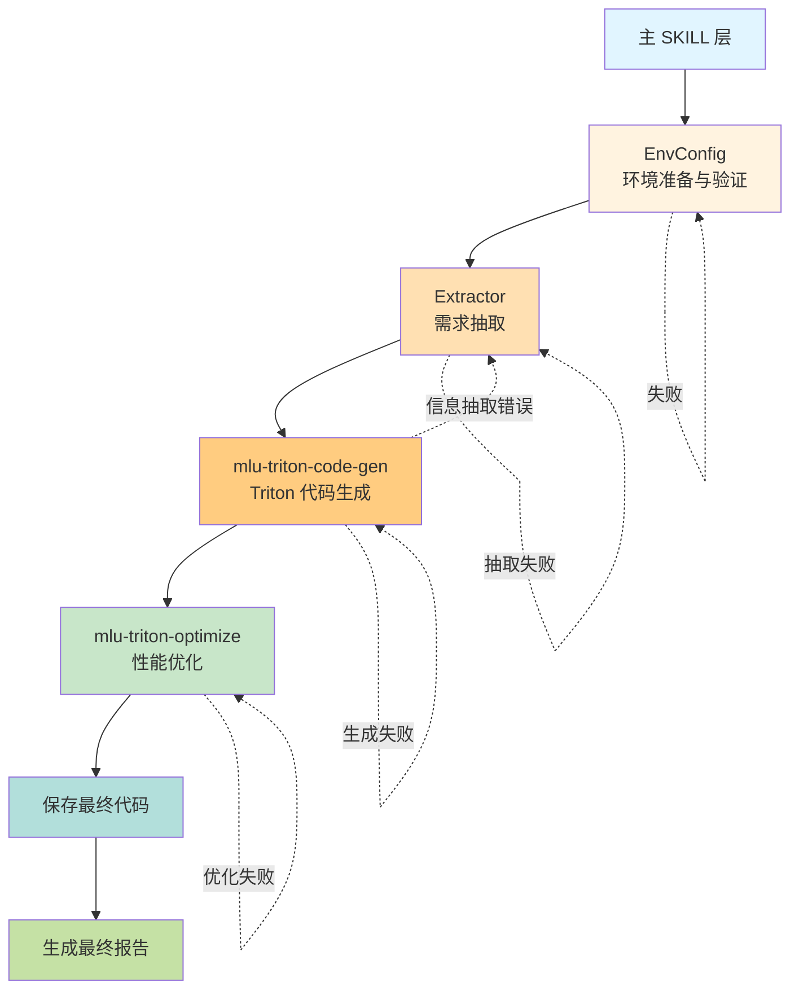

# NVIDIA GPU/CUDA Triton MAIN

## 概述

本 skill 采用**分层设计**完成任务。执行流程为：环境准备与验证 → 需求分析与验证 → Triton 代码生成 → 性能优化 → 输出最终报告和代码。

> 兼容说明：目录名、frontmatter `name`、`mlu-triton-*` 调用名和既有产物路径保持不变；实际执行目标为 NVIDIA GeForce RTX 3090（CUDA）。
>
> 源码位于仓库的 `v1/`；部署时将 `v1` 下各目录复制或映射到 `.claude/skills/`。下文 `.claude/skills/...` 均指部署后的运行路径。



## 核心原则

### Subagent 启动规则
部分任务需要通过分发给 subagent 执行，涉及 subagent 必须遵循以下规则：

- subagent 负责的任务由主流程分发
- subagent 任务一旦分发下去，主流程不允许进行任何干预，且不能替代 subagent 自行执行
- subagent 为阻塞式执行，工作完毕后才能进行允许主流程进行下一步
- 禁止并发启动多个 subagent

### 输出路径规则

如果用户没有特别指定输出存储路径`output_dir`，则 `output_dir` 默认为当前路径下的`output_mlu_triton_main`目录

### 运行环境选择

Triton 算子开发既可能运行在带 NVIDIA GPU 的本地执行环境里，也可能运行在只有 CPU 的本地执行环境里。进入 Triton 代码真实运行、精度测试、性能测试等动态步骤前，必须先判断当前环境是否具备可用 CUDA 与 RTX 3090。

**强制顺序**：所有任务开始前，必须先完成 EnvConfig 环境确认。EnvConfig 必须先在本地执行环境顺序执行以下两个脚本：

```bash
python .claude/skills/share/gpu/runtime/get_device_info.py
python .claude/skills/share/gpu/runtime/test_env_code.py
```

判定规则：

- 如果 `get_device_info.py` 和 `test_env_code.py` 都在本地执行环境 exit code = 0，则判定 `execution_backend=local`，后续 Triton 真实运行、精度测试、性能测试优先直接在本地执行。
- 如果任意一个脚本在本地执行环境失败，则判定本地 CUDA/Triton 环境不可用，必须在当前 `JOB_ID` 下通过 `.claude/skills/mlu-triton-main/subagents/scripts/submit_task_to_worker.py` 向远端 Worker 提交同一套环境检查脚本，先确认远端 RTX 3090 环境可用。
- 远端 Worker 环境检查也必须顺序执行 `get_device_info.py` 和 `test_env_code.py`，两者都成功后才允许进入后续动态步骤，并记录 `execution_backend=worker`。
- 如果本地执行环境和 Worker 环境检查都失败，必须停止工作流并报告真实 stdout/stderr，禁止继续生成依赖运行结果的结论。
- 纯文本分析、代码生成、静态检查、Python 语法检查可以在本地执行环境执行；涉及 GPU 真实运行、精度或性能结论时，必须以实际可用的 RTX 3090/CUDA 环境结果为准。
- 无论选择本地执行还是 Worker Task，都禁止为了编译、测试、精度或性能验证再新建一个 Job。
- **Worker Task 阻塞执行**：每次调用 `submit_task_to_worker.py` 必须前台同步运行，等待该进程退出（脚本内部已轮询到终态才返回，退出码 `0` 成功 / `1` 失败 / `2` 基础设施错误），拿到退出码与日志后再决定下一步。禁止 `&` 后台、禁止并发提交多个 Worker Task、禁止在脚本未返回前发起其它步骤。

Worker Task 仅作为当前本地执行环境没有可用 RTX 3090/CUDA 工具链时的执行兜底。远端环境检查命令必须使用：

```bash
python .claude/skills/mlu-triton-main/subagents/scripts/submit_task_to_worker.py \
    --task-type custom \
    --workdir <仓库根目录的绝对路径> \
    --timeout-sec 600 \
    --command "python .claude/skills/share/gpu/runtime/get_device_info.py && python .claude/skills/share/gpu/runtime/test_env_code.py"
```

后续动态执行如需走 Worker，使用方式：

```bash
python .claude/skills/mlu-triton-main/subagents/scripts/submit_task_to_worker.py \
    --task-type {accuracy|performance|custom} \
    --workdir <绝对路径> \
    --timeout-sec <运行阶段超时秒数> \
    --command "<要执行的命令>"
```

Worker Task 必须等到 `submit_task_to_worker.py` 返回退出码后再继续；结果判断以该退出码和其打印的 `task_output_dir` 下 `stdout.log`、`stderr.log`、`result.json` 为准；Agent 必须通过 `--timeout-sec` 设置 Worker lease 后才开始计时的运行阶段超时，Scheduler 会额外用当前 Job 剩余时间限制排队 + 运行的总截止时间。禁止手写 HTTP 请求绕过 `submit_task_to_worker.py`，禁止通过 Worker Task 安装、升级、卸载依赖，或修改 Worker 全局环境、系统路径、CUDA/NVIDIA 驱动等共享环境。

## 步骤

### 步骤 1：环境准备与验证

**重点要求**：分发给 subagent 执行`环境准备与验证`任务（禁止主流程接管此任务）:

使用以下方式调用该操作
```python
agent = spawn_agent(
    agent_type="default",
    message=f"""
    ## 任务文档
    根据 .claude/skills/mlu-triton-main/subagents/EnvConfig.md 中的规范要求，充当 EnvConfig 角色，逐步完成环境准备与验证任务。

    ## 用户输入
    输出存储路径：{output_dir}

    严格按照任务文档要求执行。
    """
)
```

### 步骤 2：需求抽取

**重点要求**：分发给 subagent 执行`需求抽取`任务（禁止主流程接管此任务）:

使用以下方式调用该操作
```python
agent = spawn_agent(
    agent_type="default",
    message=f"""
    ## 任务文档
    根据 .claude/skills/mlu-triton-main/subagents/Extractor.md 中的规范要求，充当 Extractor 角色，完成需求抽取任务。

    ## 用户输入
    算子功能需求描述或 Triton 代码：{user_input}
    输出存储路径：{output_dir}

    严格按照任务文档要求执行。
    """
)
```

### 步骤 3：Triton 代码生成

**输入文件**（来自步骤 2，由 `Extractor` 负责存储）：
- 需求文档：`{output_dir}/Extractor/requirement.md`

**交接文件**（由 `mlu-triton-code-gen` Skill 负责存储，供步骤 4 读取）：
- Triton Kernel 最终代码：`{output_dir}/KernelGen/triton_code_fix.py`（包含 kernel + wrapper + 测试代码，经 code-review 修复后的版本）
- 代码生成报告：`{output_dir}/KernelGen/triton_report.md`

> 说明：主 Skill **不再重复存储**以上文件，交接文件的生成与落盘统一由 `mlu-triton-code-gen` Skill 完成；本步骤只负责**按指定路径校验文件是否存在**，并在步骤 4 中按该路径读取。

使用 `mlu-triton-code-gen` Skill 中的操作指引进行 Triton 代码生成。必须直接调用/加载该 Skill，不得通过 subagent 间接调用。传入参数：
- `requirement` = `{output_dir}/Extractor/requirement.md`
- `output_dir` = `{output_dir}`

**交接验证（必须执行）**：步骤 3 结束后，必须确认 `{output_dir}/KernelGen/triton_code_fix.py` 文件存在且可读；若缺失，视为步骤 3 失败，按回退机制重跑，**禁止跳到步骤 4**。

**⚠️ 防误判提示**：`mlu-triton-code-gen` 内部报告末尾会出现"最终代码文件路径"等收尾措辞，那只是**代码生成阶段**的收尾，**不是整个工作流的结束**，必须继续进入步骤 4。
### 步骤 4：性能优化

**输入文件**（来自步骤 3，由 `mlu-triton-code-gen` Skill 负责存储）：
- Triton Kernel 代码：`{output_dir}/KernelGen/triton_code_fix.py`

**交接文件**（由 `mlu-triton-optimize` Skill 负责存储，供步骤 5 读取）：
- 优化后最终代码：`{output_dir}/Optimizer/triton_optimized.py`
- 优化结果报告：`{output_dir}/Optimizer/triton_optimized.md`

> 说明：主 Skill **不再重复存储**以上文件，交接文件由 `mlu-triton-optimize` Skill 完成落盘；本步骤只负责**按指定路径校验文件是否存在**，并在步骤 5 中按该路径读取。

**⚠️ 必须调用 `mlu-triton-optimize` Skill**：本步骤的性能优化**唯一合法执行方式**是在当前 Skill 上下文中直接调用/加载 `mlu-triton-optimize` Skill，不得通过 subagent 间接调用，不得由主 Skill 自行编写/改写优化逻辑，也不得用其他任何优化 Skill（如单独调用 `mlu-triton-opt-*` 系列子 Skill）替代。调用方式：

```python
Skill(
    skill="mlu-triton-optimize",
    args="{output_dir}/KernelGen/triton_code_fix.py {output_dir}"
)
```

传入参数：
- `triton_code` = `{output_dir}/KernelGen/triton_code_fix.py`
- `output_dir` = `{output_dir}`

**调用前检查**：确认当前已持有 `mlu-triton-optimize` Skill 入口，否则直接报错退出，**禁止自行实现优化流程**。

**交接验证（必须执行）**：步骤 4 结束后，必须确认 `{output_dir}/Optimizer/triton_optimized.py` 文件存在且可读；若缺失，视为步骤 4 失败，按回退机制重跑，**禁止跳到步骤 5**。

**禁止行为**：主 Skill 不得直接创建、改写或伪造 `{output_dir}/Optimizer/*/triton_optimized.py`、`{output_dir}/Optimizer/*/triton_optimized.md`、`{output_dir}/Optimizer/triton_optimized.py`、`{output_dir}/Optimizer/triton_optimized.md`。这些文件必须由 `mlu-triton-optimize` 内部流程及其子策略 subagent 产出。
**⚠️ 强制约束**：无论步骤 3 的产物是否已经看起来"可用"、无论当前上下文是否感觉任务已经完成，**都必须调用 `mlu-triton-optimize` Skill 执行步骤 4**，不得跳过、不得以"代码已经够好了"为由省略。步骤 4 是整个工作流不可省略的一环。

### 步骤 5：输出最终报告和代码

**输入文件**：
- 代码生成报告（步骤 3）：`{output_dir}/KernelGen/triton_report.md` —— 提供 **code-gen 阶段的精度结果**（`accuracy_pass` / `atol` / `rtol` / `max_diff`）与 **code-gen 阶段的性能结果**（`torch_ms`、`original_triton_ms`、`torch_bandwidth`、`original_triton_bandwidth` 等基线数据）
- 优化后最终代码（步骤 4）：`{output_dir}/Optimizer/triton_optimized.py`
- 优化结果报告（步骤 4）：`{output_dir}/Optimizer/triton_optimized.md` —— 提供**优化后的性能结果**（`opt_triton_ms`、`opt_triton_bandwidth`、`speedup_opt_vs_original`、`speedup_opt_vs_torch`）
- 各策略的 JSON 结果（步骤 4，按需读取）：`{output_dir}/Optimizer/{n}_{策略名}/*.json` —— 若上述 md 中某项数据缺失，从最终被选中的策略 JSON 中兜底读取

**输出文件**（最终产物）：
- 最终代码：`{output_dir}/triton_final.py`（完整内容，包含 Triton Kernel + Wrapper + 测试代码）
- 最终总结：`{output_dir}/summary.md`（整个工作流的总结，**必须**涵盖以下三组关键数据：①Code Gen 阶段精度结果、②Code Gen 阶段性能结果（优化前基线）、③Optimize 阶段性能结果（优化后），即下方"必含内容"中的第 2、3、4 项）

具体操作：
1. 读取 `{output_dir}/Optimizer/triton_optimized.py` 的完整内容，**原样写入** `{output_dir}/triton_final.py`
2. 读取上述输入文件，汇总步骤 1 ~ 步骤 4 的关键产出（环境、需求、代码生成、性能优化），按下方模板写入 `{output_dir}/summary.md`

**`summary.md` 必含内容（缺一不可）**：

1. **算子基本信息**：算子名称、需求来源、执行位置（`local` 或 `worker`，来自 `EnvConfig/config.md`）。
2. **Code Gen 阶段精度结果**（来自 `KernelGen/triton_report.md`）：
   - 精度是否通过（accuracy_pass: true/false）
   - 绝对/相对误差容限（atol / rtol）及实际误差（如有 max_diff、allclose 结果）
3. **Code Gen 阶段性能结果**（即**优化前基线**，来自 `KernelGen/triton_report.md` 或 Optimizer 策略 JSON 中的 `original_triton_ms` / `torch_ms` 字段）：
   - PyTorch 参考耗时（ms）与带宽（GB/s）
   - 优化前 Triton Kernel 耗时（ms）与带宽（GB/s）
4. **Optimize 阶段性能结果**（来自 `Optimizer/triton_optimized.md`）：
   - 优化后 Triton Kernel 耗时（ms）与带宽（GB/s）
   - 相对优化前加速比（`speedup_opt_vs_original`）
   - 相对 PyTorch 加速比（`speedup_opt_vs_torch`）
   - 最终选中的优化策略名称
5. **性能对比表**（把上述 3、4 两组数据并排列出，方便直观对比）：

   | 阶段 | Triton 耗时 (ms) | Triton 带宽 (GB/s) | 相对 PyTorch 加速比 |
   |------|------------------|---------------------|---------------------|
   | Code Gen（优化前基线） | `original_triton_ms` | `original_triton_bandwidth` | `torch_ms / original_triton_ms` |
   | Optimize（优化后） | `opt_triton_ms` | `opt_triton_bandwidth` | `speedup_opt_vs_torch` |

6. **产物索引**：列出 `triton_final.py`、`KernelGen/triton_report.md`、`Optimizer/triton_optimized.md` 等关键文件的相对路径。

> ⚠️ 若任何一项数据在对应输入文件中确实缺失，必须在 summary.md 中以 `N/A（原因：...）` 显式标注，不得省略该字段；不得伪造数据。

**交接验证（必须执行）**：最终需确认 `{output_dir}/triton_final.py` 与 `{output_dir}/summary.md` 均存在且内容非空，且 summary.md 中上述 1 ~ 6 项内容齐全。输出最终回答、声明整个 Job 完成之前，必须查询 `GET http://127.0.0.1:8086/run/v1/agent/jobs/$JOB_ID/tasks/active`，确认 `active_task_count == 0`；如果仍有 `queued`、`leased` 或 `running` 的活跃 Task，必须继续等待或处理，不能提前结束。


## 输出文件组织结构

下图明确标注了**每一步向下一步交接的文件**（标记为 👉 下一步输入），方便模型定位读取路径：
```text
{output_dir}/
├── EnvConfig/                      # 步骤 1：环境配置
│   ├── config.md                   # 人类可读的运行环境报告（local 或 worker）
│   └── runtime_info.txt            # 本地执行环境或 Worker 环境检查 stdout 原文
├── Extractor/                      # 步骤 2：需求抽取
│   └── requirement.md              👉 步骤 3 输入
├── KernelGen/                      # 步骤 3：Kernel 代码生成（含 code-review 修复迭代）
│   ├── step1_base_info.json
│   ├── step2_block_mapping.json
│   ├── step3_axis_fusion.json
│   ├── step4_code_spec.json
│   ├── step5_kernel_code.py
│   ├── step6_test_code.py
│   ├── step6_test_code_fix.py      # code-review 产物（契约：xxx.py → xxx_fix.py）
│   ├── triton_code_fix.py          👉 步骤 4 输入（由 step6_test_code_fix.py 复制改名而来）
|   └── triton_report.md            # 步骤 3 的代码生成报告
├── Optimizer/                      # 步骤 4：性能优化
│   ├── {n}_{策略名}/               # 各优化策略产物
│   ├── triton_optimized.py         👉 步骤 5 输入（优化后最终代码）
│   └── triton_optimized.md         # 优化结果报告
├── triton_final.py                 # 步骤 5：工作流最终代码（= Optimizer/triton_optimized.py 的副本）
└── summary.md                      # 步骤 5：工作流最终总结
```

> 约定：每个子目录内的文件由**对应 Skill 自行落盘**；主 Skill 仅负责**按路径校验 + 读取**下一步所需的交接文件（即 👉 标注的文件）。
