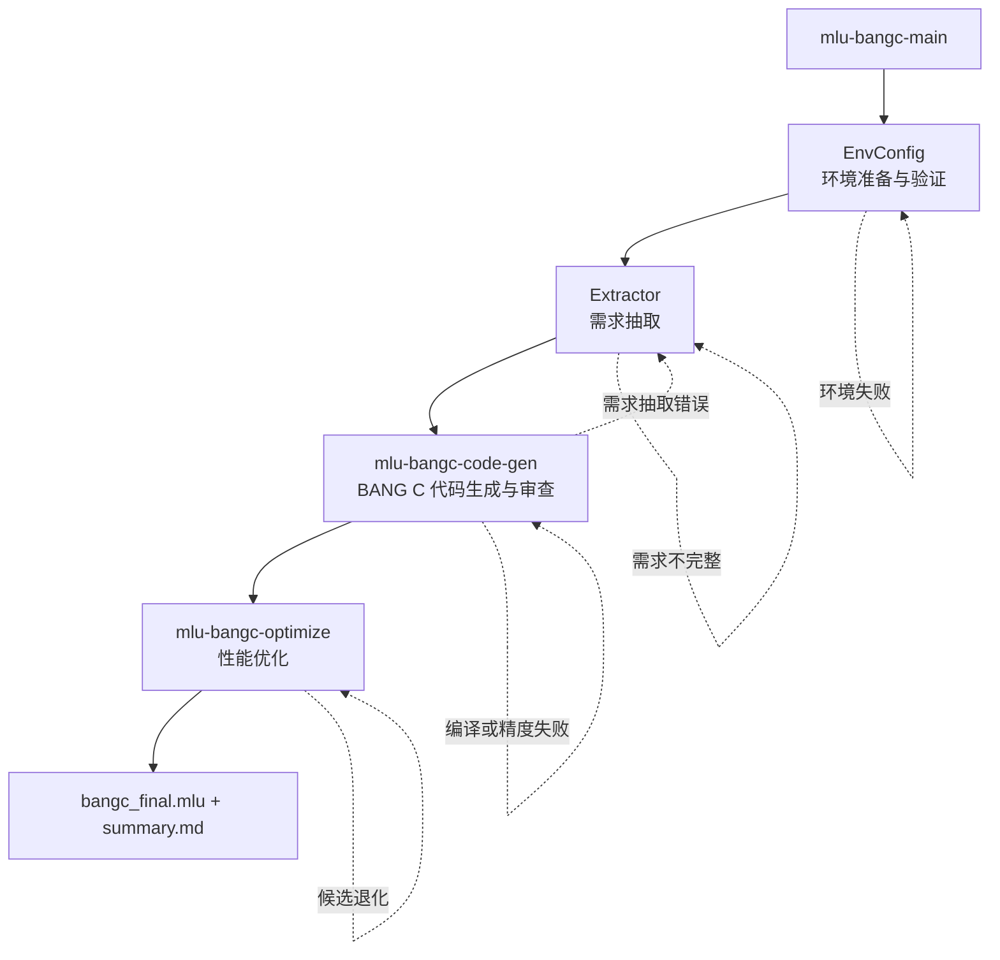

# MLU BANG C MAIN

## 概述

按固定顺序执行：环境准备与验证 → 需求抽取 → BANG C 代码生成与审查 → 性能优化 → 输出最终代码与报告。



## 核心原则

- 目标平台是 MLU590，设备侧语言是 BANG C，主机侧运行时是 CNRT，编译器是 CNCC。
- 保留用户提供的算子语义、接口、shape、stride、dtype、别名关系和误差阈值；不得为了通过测试改写需求。
- 不根据 `MLU590` 营销名称猜测 CNCC 架构参数、片上存储容量、核心数或 intrinsic 支持。只使用环境探测或用户提供且已验证的值。
- 静态生成可以在 CPU 环境完成；编译通过、精度通过和性能数据必须来自真实可用的 MLU 执行环境。
- 禁止把 CPU fallback、CNRT 调用绕过、空 kernel 或跳过 kernel 当作 BANG C 修复结果。
- 所有性能比较必须使用相同输入、相同编译配置、相同计时范围和相同执行后端。
- 缺失证据时写 `N/A（原因：...）`、`UNAVAILABLE` 或 `target_verified=false`，不得伪造编译、精度或性能结论。

### Subagent 启动规则

- EnvConfig 和 Extractor 由主流程分发给对应 subagent。
- subagent 任务为阻塞式任务；等待其完成并检查约定产物后再进入下一步。
- 不得由主流程伪造 subagent 负责的文件。
- Worker Task 也必须前台同步执行；禁止在同一算子目录内并发运行会竞争 MLU 或覆盖产物的任务。

### 输出路径

若用户未指定 `output_dir`，使用当前目录下的 `output_mlu_bangc_main`。

## 运行环境选择

所有任务开始前，先顺序执行：

```bash
python3 .claude/skills/share/mlu/runtime/get_device_info.py
python3 .claude/skills/share/mlu/runtime/test_env_code.py
```

判定规则：

- 两个脚本均以退出码 `0` 完成时，记录 `execution_backend=local` 和 `target_verified=true`。
- 任一脚本失败时，在当前 `JOB_ID` 下通过 `.claude/skills/mlu-bangc-main/subagents/scripts/submit_task_to_worker.py` 向 MLU590 Worker 顺序提交同一组检查；禁止新建 Job 绕过当前工作流。
- Worker 上两个脚本均成功时，记录 `execution_backend=worker` 和 `target_verified=true`。
- 本地与 Worker 均不可用时，停止所有依赖 MLU 运行结果的步骤，保存真实 stdout/stderr，并报告阻断原因。
- 不得通过 Worker 安装、升级或删除依赖，也不得修改 Worker 的全局环境、NeuWare/CNToolkit、驱动或系统路径。

环境检查的 Worker 命令：

```bash
python3 .claude/skills/mlu-bangc-main/subagents/scripts/submit_task_to_worker.py \
  --task-type custom \
  --workdir <仓库根目录绝对路径> \
  --timeout-sec 600 \
  --command "python3 .claude/skills/share/mlu/runtime/get_device_info.py && python3 .claude/skills/share/mlu/runtime/test_env_code.py"
```

后续动态步骤如需 Worker，使用：

```bash
python3 .claude/skills/mlu-bangc-main/subagents/scripts/submit_task_to_worker.py \
  --task-type {compile|accuracy|performance|custom} \
  --workdir <绝对路径> \
  --timeout-sec <正整数秒数> \
  --command "<要执行的原始命令>"
```

以脚本退出码和其报告的 `task_output_dir` 下 `stdout.log`、`stderr.log`、`result.json` 为准：`0` 成功，`1` 任务失败，`2` 基础设施或输入错误，`3` 任务取消。

## 步骤 1：环境准备与验证

分发 subagent，要求其严格执行：

```text
读取 .claude/skills/mlu-bangc-main/subagents/EnvConfig.md，完成 MLU590 BANG C/CNRT 环境验证。
输入：output_dir={output_dir}
输出：{output_dir}/EnvConfig/config.md 和 runtime_info.txt
```

继续前必须确认两份文件存在、非空，且 `config.md` 明确记录 `execution_backend`、`target_verified`、CNCC/CNRT 与设备探测结果。

## 步骤 2：需求抽取

分发 subagent，要求其严格执行：

```text
读取 .claude/skills/mlu-bangc-main/subagents/Extractor.md，抽取算子需求。
输入：user_input={user_input}
输入：output_dir={output_dir}
输入：env_config={output_dir}/EnvConfig/config.md
输出：{output_dir}/Extractor/requirement.md
```

若输入是完整或部分 BANG C/CNRT 源码，还应保存 `{output_dir}/Extractor/original_code.mlu`。继续前必须确认 `requirement.md` 存在且包含可执行的数学、接口、布局、数值与测试契约。

## 步骤 3：BANG C 代码生成与审查

直接加载 `mlu-bangc-code-gen` Skill，不通过普通 subagent 间接替代该 Skill：

```python
Skill(
    skill="mlu-bangc-code-gen",
    args="{output_dir}/Extractor/requirement.md {output_dir}"
)
```

输入：

- `requirement` = `{output_dir}/Extractor/requirement.md`
- `output_dir` = `{output_dir}`
- 环境事实 = `{output_dir}/EnvConfig/config.md`

交接产物：

- `{output_dir}/KernelGen/bangc_code_fix.mlu`：完整 BANG C kernel、CNRT host launcher/reference/test/benchmark，经 code-review 修复后的版本。
- `{output_dir}/KernelGen/bangc_report.md`：编译命令、精度证据、优化前性能基线与证据来源。

继续前必须检查两份产物存在且可读。若报告显示 `compile_pass=false`、`accuracy_pass=false`、`blocked=true` 或 `target_verified=false`，不得进入会声称真机成功的优化流程；返回 code-gen/review 修复或报告真实阻断。

## 步骤 4：性能优化

必须直接加载 `mlu-bangc-optimize` Skill：

```python
Skill(
    skill="mlu-bangc-optimize",
    args="{output_dir}/KernelGen/bangc_code_fix.mlu {output_dir}"
)
```

输入：

- `bangc_code` = `{output_dir}/KernelGen/bangc_code_fix.mlu`
- `output_dir` = `{output_dir}`
- `execution_backend` 来自 `{output_dir}/EnvConfig/config.md`

交接产物：

- `{output_dir}/Optimizer/bangc_optimized.mlu`
- `{output_dir}/Optimizer/bangc_optimized.md`

主 Skill 不得伪造或直接代写 Optimizer 目录内的策略结果。若没有候选在相同验证条件下优于基线，优化器仍应输出已验证的 best-so-far（可以是原始代码）并明确 `decision=no_improvement`。

## 步骤 5：输出最终代码和报告

1. 原样复制 `{output_dir}/Optimizer/bangc_optimized.mlu` 为 `{output_dir}/bangc_final.mlu`。
2. 综合以下证据生成 `{output_dir}/summary.md`：
   - `EnvConfig/config.md`
   - `Extractor/requirement.md`
   - `KernelGen/bangc_report.md`
   - `Optimizer/bangc_optimized.md`
   - 最终候选策略 JSON（仅在报告字段缺失时兜底）

`summary.md` 必须包含：

1. 算子名称、需求来源、接口、shape/dtype 范围。
2. 执行位置、设备型号、CNCC/CNRT 版本、实际编译命令与 `target_verified`。
3. Code Gen 精度：`accuracy_pass`、`atol`、`rtol`、`max_diff`，以及 NaN/Inf 等特殊值策略。
4. 优化前性能：`host_reference_ms`、`original_bangc_ms`、相应带宽或吞吐量及计时范围。
5. 优化后性能：`opt_bangc_ms`、相应带宽或吞吐量、`speedup_opt_vs_original`、`speedup_opt_vs_reference`、最终策略。若优化报告只给出 `performance.speedup`，把它解释为相对 `original_bangc_ms`；两个显式加速比优先由同表耗时计算，任一分母缺失或为零时写 `N/A`。
6. 编译、运行、精度或性能不可用时的明确原因，字段仍需保留并标记 `N/A`。
7. 关键产物相对路径。

性能对比表使用以下结构：

| 阶段 | Kernel/Reference 耗时 (ms) | 带宽或吞吐量 | 相对 Reference 加速比 |
|---|---:|---:|---:|
| Host reference | `host_reference_ms` | `host_reference_throughput` | `1.0x` |
| Code Gen BANG C | `original_bangc_ms` | `original_bangc_throughput` | `host_reference_ms / original_bangc_ms` |
| Optimize BANG C | `opt_bangc_ms` | `opt_bangc_throughput` | `speedup_opt_vs_reference` |

最终确认 `bangc_final.mlu` 与 `summary.md` 均存在且非空。若当前运行环境提供 Agent-Service，在声明整个 Job 完成前查询当前 `JOB_ID` 的活跃 Task，确认不存在 `queued`、`leased` 或 `running` 任务。

## 输出组织

```text
{output_dir}/
├── EnvConfig/
│   ├── config.md
│   └── runtime_info.txt
├── Extractor/
│   ├── requirement.md              # 下一步输入
│   └── original_code.mlu           # 仅源码输入时
├── KernelGen/
│   ├── step1_base_info.json
│   ├── step1_io_shapes.json
│   ├── step2_block_mapping.json
│   ├── step3_axis_fusion.json
│   ├── step4_code_spec.json
│   ├── step5_kernel_code.mlu
│   ├── step6_test_code.mlu
│   ├── bangc_code_fix.mlu           # 下一步输入
│   └── bangc_report.md
├── Optimizer/
│   ├── {n}_{策略名}/
│   ├── bangc_optimized.mlu          # 最终候选
│   └── bangc_optimized.md
├── bangc_final.mlu
└── summary.md
```

每个子目录由对应 Skill 落盘；主 Skill 只校验、读取和汇总约定的交接产物。
